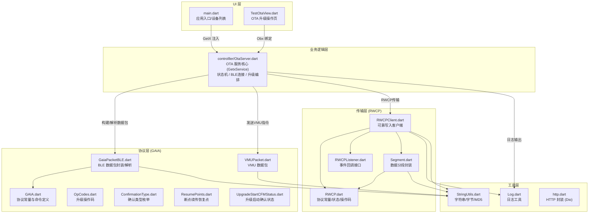
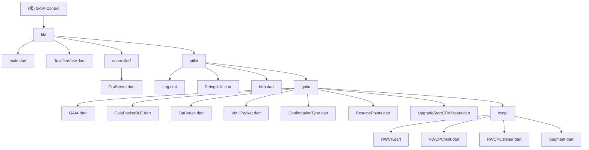

# GAIA Control - 项目架构文档

## 项目概述

| 属性 | 值 |
|------|-----|
| 名称 | GAIA Control |
| 包名 | `gaia` |
| 版本 | 1.0.0+1 |
| 描述 | 基于官方 gaiacontrol_3_4_0_52，通过 Dart 完全移植 BLE OTA 功能，支持 Android/iOS |
| SDK | Flutter >=3.5.0 <4.0.0 |
| 状态管理 | GetX (get: ^4.7.2) |
| BLE 通信 | flutter_reactive_ble: ^5.4.0 |
| 协议基础 | Qualcomm GAIA (CSR) / RWCP 可靠传输协议 |

---

## 架构总览

### 分层架构图



### 模块结构图



---

## 模块索引

| 模块路径 | 说明 | 语言 | 模块 CLAUDE.md |
|----------|------|------|----------------|
| `lib/controlller/` | OTA 服务核心 -- BLE 连接管理、升级状态机、分包传输编排 | Dart | [controlller/CLAUDE.md](./lib/controlller/CLAUDE.md) |
| `lib/utils/gaia/` | GAIA 协议实现 -- Qualcomm CSR 蓝牙协议命令、数据包、操作码 | Dart | [gaia/CLAUDE.md](./lib/utils/gaia/CLAUDE.md) |
| `lib/utils/gaia/rwcp/` | RWCP 可靠传输协议 -- 滑动窗口、序列号管理、数据分段 | Dart | [rwcp/CLAUDE.md](./lib/utils/gaia/rwcp/CLAUDE.md) |
| `lib/utils/` (根工具) | 通用工具 -- 日志、字符串/字节处理、HTTP 封装 | Dart | 无（文件较少，已在根文档覆盖） |

---

## 核心依赖说明

| 依赖 | 版本 | 用途 |
|------|------|------|
| `flutter_reactive_ble` | ^5.4.0 | BLE 设备扫描、连接、特征值读写与通知订阅 |
| `get` (GetX) | ^4.7.2 | 状态管理 (Obx/Rx)、依赖注入 (Get.put/Get.find)、路由导航 |
| `dio` | ^5.9.0 | HTTP 客户端封装（固件下载等网络请求） |
| `crypto` | ^3.0.6 | MD5 校验（固件文件完整性验证） |
| `permission_handler` | ^12.0.1 | 运行时权限请求（蓝牙、存储） |
| `path_provider` | ^2.1.5 | 获取应用文档目录路径（固件存储） |
| `file_picker` | ^10.1.9 | 文件选择器（用户选择本地固件文件） |
| `cupertino_icons` | ^1.0.8 | iOS 风格图标 |
| `flutter_lints` | ^5.0.0 | 静态分析规则（dev） |

---

## 运行与开发

### 环境要求

- Flutter SDK >=3.5.0 <4.0.0
- Dart SDK（随 Flutter 捆绑）
- Android Studio / Xcode（平台编译）
- 真机设备（BLE 功能需真机调试）

### 常用命令

```bash
# 安装依赖
flutter pub get

# 静态检查
flutter analyze

# 运行测试
flutter test

# 本地调试
flutter run -d android
flutter run -d ios

# 构建发布包
flutter build apk --release      # Android
flutter build ios --release       # iOS

# 代码格式化
dart format lib test
```

### 目录说明

| 目录 | 用途 |
|------|------|
| `lib/` | 核心业务代码（17 个 Dart 文件） |
| `test/` | 测试代码（当前仅 widget_test.dart） |
| `android/` | Android 平台壳工程 |
| `ios/` | iOS 平台壳工程 |
| `gaia-client-src/` | Android 原始 Java 参考源码（非 Flutter 代码） |
| `img/` | README 展示图片资源 |

---

## 测试策略

- 测试框架：`flutter_test`
- 当前状态：仅有 `test/widget_test.dart` 基础测试
- 文件命名：`*_test.dart`
- 测试描述建议采用 "行为 + 预期结果" 格式，如：`'startOta sends upgrade packet'`
- 变更 `lib/utils/gaia/` 或 `OtaServer` 的协议/传输逻辑时，至少补充一个对应单元或组件测试

---

## 编码规范

- **缩进**：2 空格，遵循 Dart 官方格式
- **命名规则**：
  - 类型：`PascalCase`
  - 变量/方法：`lowerCamelCase`
  - 常量：`lowerCamelCase` + `const`
- **文件名**：新增文件使用 `snake_case.dart`（历史文件命名可逐步迁移）
- **提交格式**：Conventional Commit -- `feat/fix/refactor/test/docs(scope): summary`
- **原则**：KISS（保持简洁）、DRY（避免重复）、YAGNI（仅实现当前需求）
- **协议代码管理**：协议相关代码集中在 `lib/utils/gaia/`，新增协议能力时优先在该目录扩展
- **安全**：不提交密钥、证书、真实设备标识或抓包敏感数据

---

## AI 使用指引

- 本项目从 Qualcomm GAIA Control Android 版 Java 代码移植而来，`gaia-client-src/` 目录保留了原始参考源码
- OtaServer.dart 是整个项目的核心枢纽（约 2060 行），修改时需理解其状态机流程
- GAIA 协议相关常量定义在 `GAIA.dart`（约 36KB），操作码定义在 `OpCodes.dart`
- BLE 特征值 UUID 在 OtaServer 中硬编码，分别用于 OTA 服务发现、通知订阅、写入和无响应写入
- 支持 V1/V2（Vendor 0x000A）和 V3（Vendor 0x001D）两种协议模式，可通过 Auto 模式自动探测
- RWCP 传输使用滑动窗口机制，窗口默认 15、最大 32

---

## 变更记录 (Changelog)

| 时间 | 操作 | 说明 |
|------|------|------|
| 2026-02-10 22:00:06 CST | 初始化创建 | 由架构初始化工具生成根级与模块级 CLAUDE.md |
