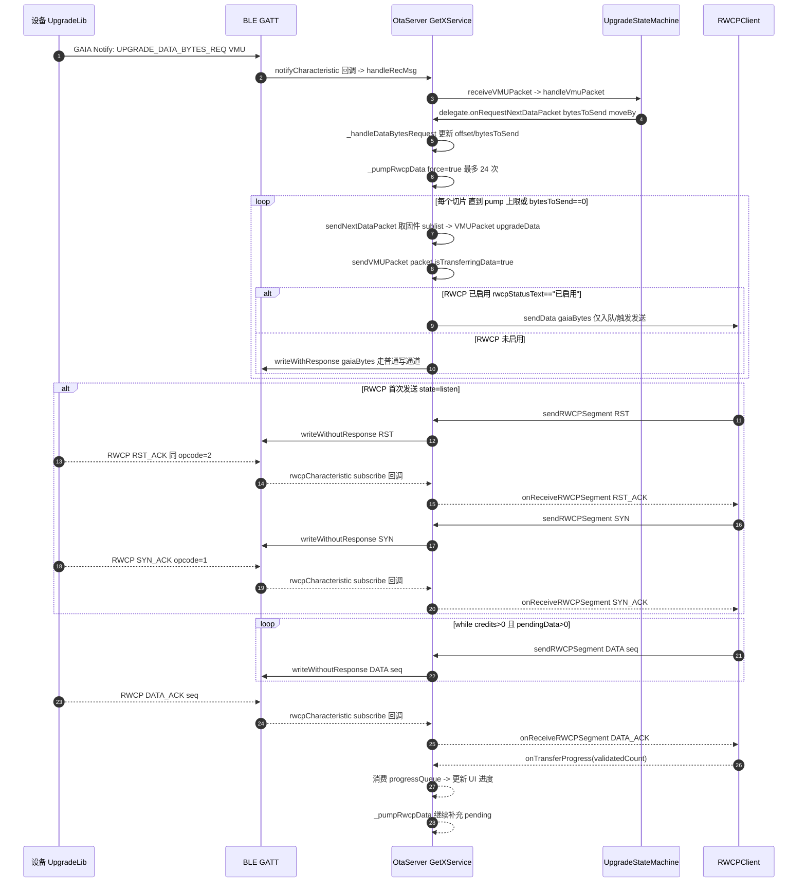
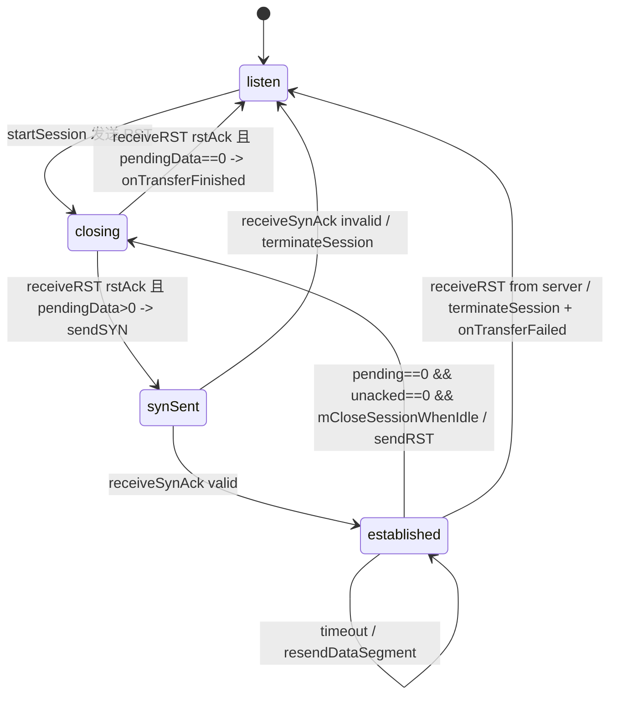
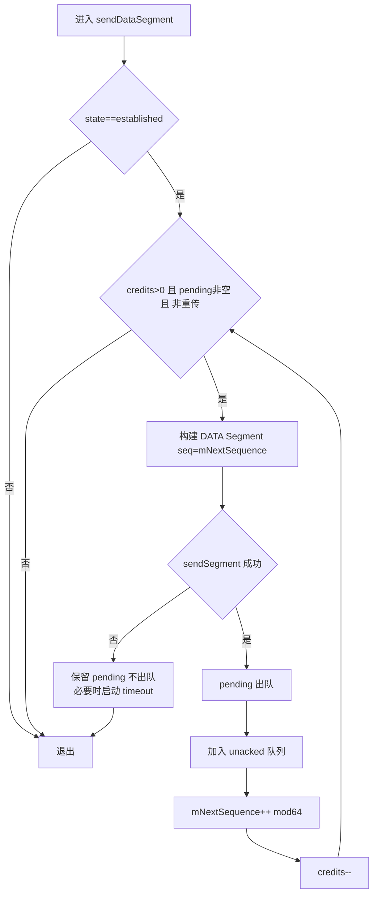
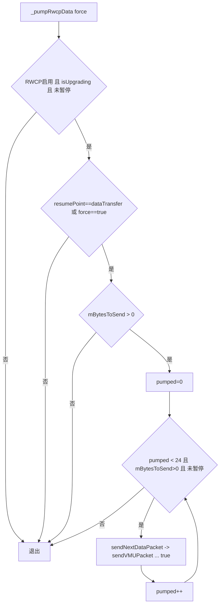

# RWCP「窗口发送」逻辑复现文档（Flutter-GAIAControl）

> 目的：把本项目 **RWCP 滑动窗口发送**的完整链路（从 OTA 数据切片 → RWCP 入队 → 窗口发包 → ACK/GAP/超时重传 → UI 进度）用 Mermaid 画出来，方便同事按图复现与定位问题。  
> 适用范围：本项目当前实现（`lib/controller/ota_server.dart` + `lib/utils/gaia/rwcp/rwcp_client.dart` + `lib/controller/ble_connection_manager.dart`）。

---

## 1. 关键对象与职责边界（先建立心智模型）

### 1.1 关键类

| 组件 | 文件 | 责任（与窗口发送相关） |
|---|---|---|
| `OtaServer` | `lib/controller/ota_server.dart` | 1) 将固件切片为 VMU `upgradeData` 包；2) 触发 RWCP 泵（避免 pending 爆炸）；3) 作为 `RWCPListener` 把 RWCP Segment 写到 BLE；4) 作为 `UpgradeStateMachineDelegate` 响应设备请求（`DATA_BYTES_REQ` 等）。 |
| `UpgradeStateMachine` | `lib/controller/upgrade_state_machine.dart` | 解析 VMU 指令流、驱动升级状态；当设备请求数据时调用 delegate 的 `onRequestNextDataPacket(bytesToSend, moveBy)`。 |
| `RWCPClient` | `lib/utils/gaia/rwcp/rwcp_client.dart` | RWCP 协议实现：状态机（listen/synSent/established/closing）+ 滑动窗口（`mWindow`/`mCredits`）+ 超时重传 + GAP 缩窗。 |
| `BleConnectionManager` | `lib/controller/ble_connection_manager.dart` | BLE transport 封装，负责写入特征值。本项目已在此层增加 **GATT 串行化**，避免并发 write 导致 “GATT busy”。 |

### 1.2 两层“窗口”的区别（非常容易混淆）

1) **RWCP 窗口（协议层）**：`RWCPClient.mWindow` 与 `mCredits` 控制同一时刻在飞的 RWCP DATA Segment 数量。  
2) **应用层泵阈值（工程层）**：`OtaServer._kRwcpPumpMaxPacketsPerTick`（默认 24）限制每次把多少个 OTA 切片喂给 RWCP，避免 `RWCPClient.mPendingData` 无上限膨胀造成内存峰值/卡顿/OOM。

> 复现场景里如果看到“窗口为 15，但 pending 巨大”，这通常是 **应用层泵没控住** 或 **设备 ACK 变慢导致 pending 堆积**。

---

## 2. 端到端发送链路（从设备请求到窗口发包）

### 2.1 端到端时序图（最重要）

### 2.2 这里的“坑点”

1) **RST/RST_ACK opcode 相同**：在 `rwcp.dart` 里 `rst` 与 `rstAck` 都是 opcode `2`（`RWCPOpCodeServer.rst`/`rstAck`），因此 `RWCPClient.receiveRST()` 在 `closing` 状态下把收到的 opcode=2 视为 ack。  
2) **发送链路一定要串行化**：本项目已在 `BleConnectionManager` 内部串行化 write（否则 RWCP 的窗口再完美，也会被底层 GATT 并发写搞崩）。  
3) **应用层泵不是无限**：`_pumpRwcpData` 每次最多 24 次，避免 pendingData 无上限增长；但如果设备 ACK 极慢，pending 仍会逐渐堆积（只是堆积速度可控）。

---

## 3. RWCPClient 内部：状态机 + 滑动窗口

### 3.1 RWCP 状态机图

### 3.2 协议常量速查（复现时请用这些数值对齐日志/抓包）

> 来源：`lib/utils/gaia/rwcp/rwcp.dart`

| 常量 | 值 | 说明 |
|---|---:|---|
| `RWCP.windowDefault` | 15 | 初始窗口（默认可并发 in-flight 的 DATA 段数量上限） |
| `RWCP.windowMax` | 32 | 最大窗口 |
| `RWCP.synTimeoutMs` | 1000 | SYN 超时 |
| `RWCP.rstTimeoutMs` | 1000 | RST 超时 |
| `RWCP.dataTimeoutMsDefault` | 100 | DATA 超时初始值（超时会指数退避到 `dataTimeoutMsMax`） |
| `RWCP.dataTimeoutMsMax` | 2000 | DATA 超时最大值 |
| `RWCP.sequenceNumberMax` | 63 | 序列号 6-bit，取值 0..63 |

### 3.3 Segment 头部位定义（抓包时用于解析）

> 来源：`lib/utils/gaia/rwcp/segment.dart` + `lib/utils/gaia/rwcp/rwcp.dart`

- 头部 1 字节：`[ seq(6bit) | op(2bit) ]`
  - `seq`：低 6 位（0..63）
  - `op`：高 2 位（0..3）
- Client opcode（`RWCPOpCodeClient`）：
  - `0`：DATA
  - `1`：SYN
  - `2`：RST
  - `3`：reserved
- Server opcode（`RWCPOpCodeServer`）：
  - `0`：DATA_ACK
  - `1`：SYN_ACK
  - `2`：RST / RST_ACK（同一 opcode，需结合状态机判定）
  - `3`：GAP

### 3.2 “窗口发送”的核心变量（读代码时盯住它们）

| 变量 | 含义 | 代码位置 |
|---|---|---|
| `mWindow` | 当前窗口大小（最大 in-flight DATA segments） | `rwcp_client.dart` |
| `mCredits` | 当前剩余 credit（还允许发送多少个 segment） | `rwcp_client.dart` |
| `mPendingData` | 待发送 payload 队列（每个元素是一个“上层 payload”） | `rwcp_client.dart:44` |
| `mUnacknowledgedSegments` | 已发送但未 ACK 的 segments 队列 | `rwcp_client.dart:48` |

> **关键理解**：`sendDataSegment()` 只在 `mState==established` 且 `mCredits>0` 时从 `mPendingData` 拿数据转成 Segment 发出，并把 Segment 放到 `mUnacknowledgedSegments`。

### 3.3 sendDataSegment 的流程图（窗口到底怎么跑）

### 3.4 ACK 如何推进窗口（为什么 validatedCount 可能 > 1）

`receiveDataAck()` 的关键点：

1) 先 `validateAckSequence(RWCPOpCodeClient.data, ackSeq)`：  
   - 会从 `mLastAckSequence` 循环推进到 `ackSeq`，每前进一步都尝试在 `mUnacknowledgedSegments` 中移除对应 segment；  
   - 每移除一个 segment：`mCredits++`（直到 `mCredits==mWindow`）并统计 `acknowledged++`。  
2) 然后调用 `increaseWindow(acknowledged)`：当累计 ACK 数达到当前窗口 `mWindow` 时，窗口 +1（最多到 `mMaximumWindow`），并同时 `mCredits++`。  
3) 最后通过 `mListener.onTransferProgress(validated)` 通知上层（这里上层是 `OtaServer`）。

> 因为 ACK 序列号可能是“累计确认”（一次确认多个 segment），所以 validatedCount 可能 > 1。

---

## 4. OtaServer 如何把“固件切片”变成“窗口发送”

### 4.1 设备请求数据触发点

当设备发来 `UPGRADE_DATA_BYTES_REQ`（VMU）时，`UpgradeStateMachine` 会回调：

- `OtaServer.onRequestNextDataPacket(bytesToSend, moveBy)`  
  → `_handleDataBytesRequest(bytesToSend, moveBy)`  
  → 若启用 RWCP：`_pumpRwcpData(force: true)`

### 4.2 泵（pump）逻辑（工程级的“第二层窗口”）

### 4.3 进度条为什么要用 progressQueue（以及一个大坑）

本项目在 RWCP 模式下采用：

- 发送时：`onFileUploadProgress()` 计算 `percentage`，把它 **入队到 `mProgressQueue`**。  
- ACK 时：`onTransferProgress(validatedCount)` 从 `mProgressQueue` **按 ACK 数量弹出**，将最后一个 percentage 写回 `updatePer`。

这样做的原因是：RWCP 的 ACK 可能是“累计确认”，并且可能发生重传/缩窗/会话切换，直接用 `mStartOffset` 推导进度会出现抖动。

**大坑（代码里已经做了保护）：**  
当 ACK 来了，但 `mProgressQueue` 为空（例如重传/会话重置导致），如果把默认 0 写回 UI，会造成“进度从 100% 回跳到 0%”的假象。  
因此 `OtaServer.onTransferProgress()` 在 `mProgressQueue.isEmpty` 时会直接 return（不更新 UI）。

---

## 5. 重点与坑点清单（复现/排障时优先检查）

### 5.1 必看：底层写入是否并发（会直接摧毁一切上层假设）

症状：
- 日志出现 “GATT busy / write failed / 断链”
- 设备端持续 GAP 或 ACK 变慢

本项目现状：
- `BleConnectionManager` 已对 write/mtu 做串行化（GATT op chain），避免并发 write。

### 5.2 GAP 的语义坑（最难排）

`RWCPClient.receiveGAP()` 特意做了兼容：
- 有些设备 GAP 段携带的是“下一期待序列号”，不是“最后已确认序列号”。  
如果误把 gapSequence 当作已确认，会导致缺口段永远不重传 → 传输卡死。

所以代码采用：
- `ackSequence = gapSequence - 1`
- 先 `decreaseWindow()` 再 `resendDataSegment()`

### 5.3 closeSessionWhenIdle 的坑（末期断链/抖动）

当 `pending==0 && unacked==0` 时，如果 `mCloseSessionWhenIdle==true`：
- RWCP 会自动发 RST 收尾。

如果你在“validation 轮询”阶段也保持 true，可能导致频繁 RST/SYN 抖动，某些设备会更容易断链。  
（本项目已有注释建议：validation 轮询阶段设为 false）

### 5.4 断开连接时必须停止后台 Timer/轮询

否则会出现：
- UI 已退出/蓝牙已断开，但后台仍在发 validation 轮询或其它包，导致状态错乱。

本项目现状：
- `OtaServer.disconnect()` 会调用 `UpgradeStateMachine.dispose()`，取消 validation 轮询 timer。

---

## 6. 给同事的“复现步骤建议”（不依赖源码改动）

1) 打开 App → 扫描 → 连接设备 → 进入 `TestOtaView`。  
2) 选择固件 → 开始升级。  
3) 观察日志（UI 的 LOG 区域）：  
   - 关注关键关键字：`RWCP`、`send data segments`、`Receive dataAck`、`Receive gap`、`TIME OUT`、`decrease window`、`increase window`。  
4) 若要复现窗口变化：  
   - 让设备端人为变慢 ACK（例如写 flash 阶段、或降低连接参数），会看到 `pendingData` 增长、timeout 重传、缩窗。  
5) 若要复现 GAP：  
   - 人为制造丢包/乱序（部分 BLE 抓包工具或中间层可做到），观察 `Receive gap` → `decrease window` → `resendDataSegment`。

> 注：`RWCPClient` 的日志输出依赖 `Log.isLog && kDebugMode`；UI 日志主要来自 `OtaServer.addLog()`（`LogBuffer`）。

---

## 7. 快速索引（从图回到代码）

- RWCP 窗口发送：`RWCPClient.sendDataSegment()` / `receiveDataAck()` / `validateAckSequence()` / `increaseWindow()` / `decreaseWindow()`  
  → `lib/utils/gaia/rwcp/rwcp_client.dart`
- 会话建立（RST→SYN）：`RWCPClient.startSession()` / `receiveRST()` / `sendSYNSegment()` / `receiveSynAck()`  
  → `lib/utils/gaia/rwcp/rwcp_client.dart`
- 泵（限制 pending）：`OtaServer._pumpRwcpData()` + `_kRwcpPumpMaxPacketsPerTick`  
  → `lib/controller/ota_server.dart`
- BLE 写入通道：`OtaServer.sendRWCPSegment()` → `writeMsgRWCP()` → `BleConnectionManager.writeWithoutResponse()`  
  → `lib/controller/ota_server.dart` + `lib/controller/ble_connection_manager.dart`
